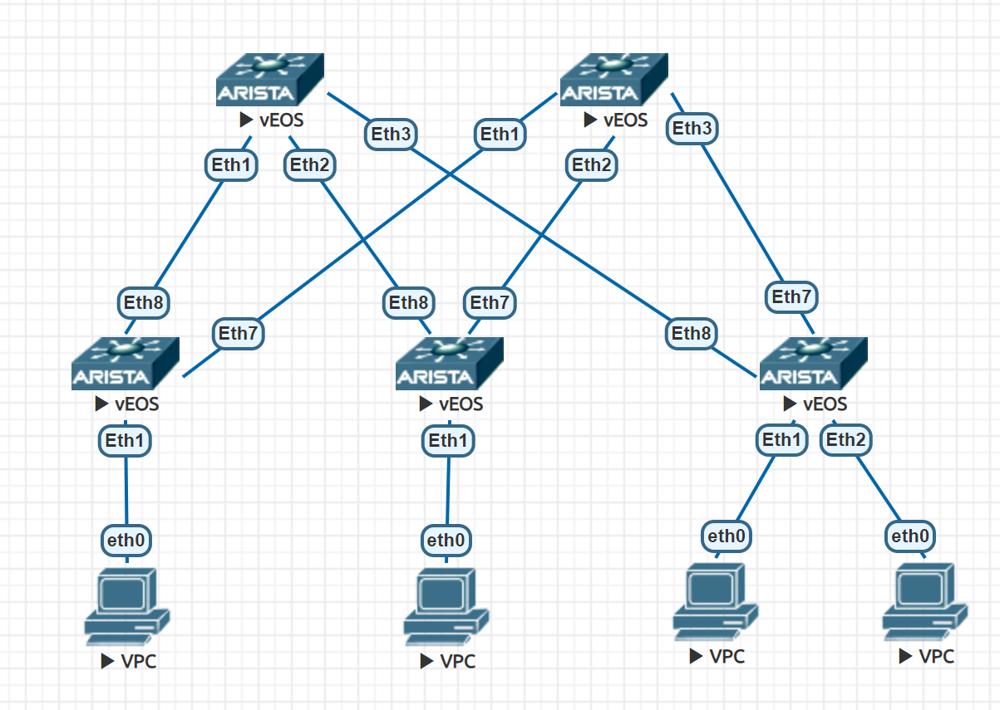

# Here is a scheme and IP plan of the lab data center.

**Lab DC is based on a CLOS topology and it's simulated by EVENG tool**

Task 1: Generate an IP plan

| Segment | Loopback's     | ptp's           |
| ------- | -------------- | --------------- |
| Spine   | 172.16.0.0/27  | 172.16.0.64/26  |
| Leaf    | 172.16.0.32/27 | 172.16.0.128/26 |
